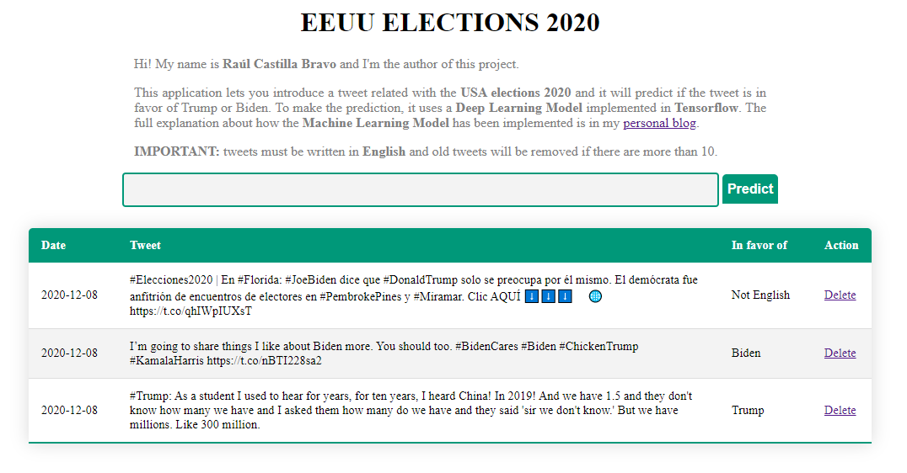
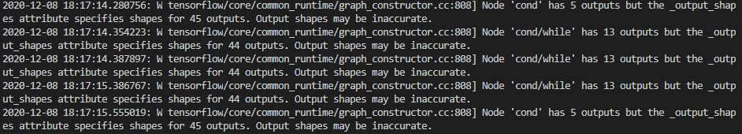
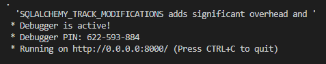

# Get started

To execute the project, you have to create a virtual environment and install the requirements.txt with the command

*pip install -r requirements.txt*
  
It can take a minute as it has to install Tensorflow, which is a heavy package. Then, you can run the project by running the main.py script. 
When you run it, you will see an output like thi:

But don't worry, it's the Tensorflow model loading. You will be able to use the app when appears this output:

Then, you can open a web browser and navigate to *localhost/8000* and you will see the app.

If you want to see how the DeepLearning model has been done, check the post I have made in my [personal blog](https://raulcastillabravo.blogspot.com/2020/12/binary-text-classifier-for-eeuu.html). You can download the DeepLearning project in this [link](https://github.com/raulcastillabravo/EEUU-Elections-Tweets-Tensorflow)
